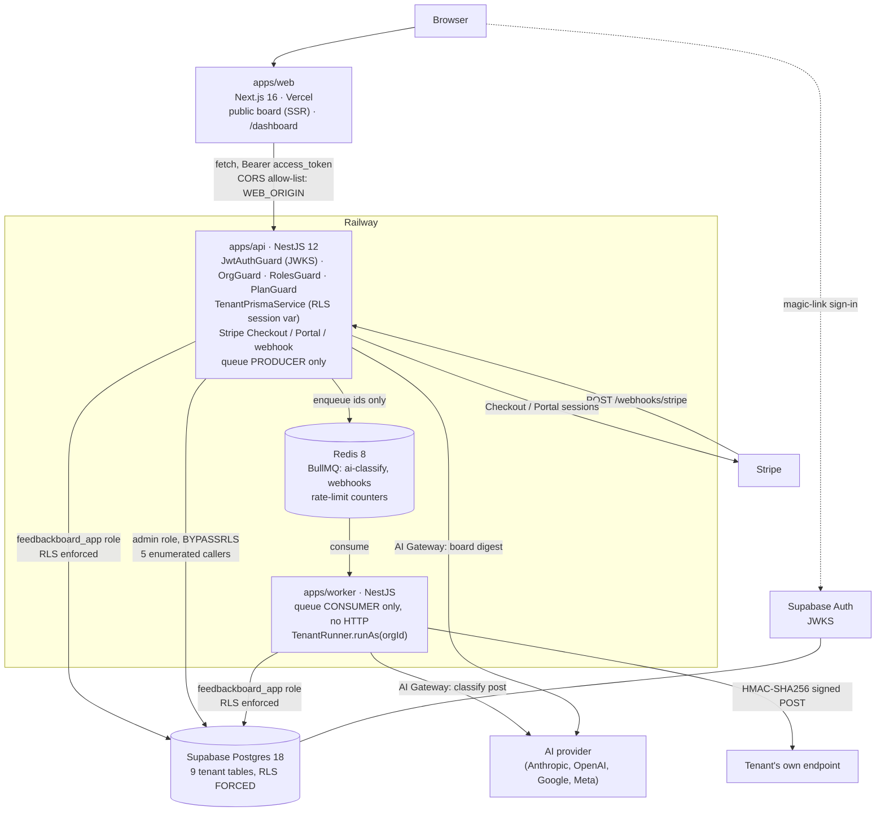

# FeedbackBoard

A small multi-tenant feedback and feature-voting SaaS in the style of Canny or Frill. Every organisation gets a votable public board. New posts are classified by AI in the background, admins can generate an on-demand AI digest of open feedback, and a Stripe subscription lifts the FREE plan caps and unlocks outbound webhooks.

The domain is deliberately small. The project exists to demonstrate, end to end:

- **Defense-in-depth multi-tenancy**: application-layer scoping plus Postgres Row-Level Security, with `FORCE ROW LEVEL SECURITY` and an unprivileged database role.
- **Stripe billing lifecycle**: Checkout, Customer Portal, idempotent webhooks, downgrade handling.
- **Inbound and outbound webhooks**: Stripe in, HMAC-signed deliveries out, with durable retries.
- **Queue-based background work**: Redis + BullMQ, consumed by a separate `apps/worker` deployable.
- **Provider-agnostic AI**: Vercel AI SDK + AI Gateway; the model and vendor are an environment variable, not code.

## Live demo

|                           |                                                                              |
| ------------------------- | ---------------------------------------------------------------------------- |
| Public board (no sign-in) | <https://feedbackboard.eosmin.dev/acme/feedback>                             |
| Web app                   | <https://feedbackboard.eosmin.dev>                                           |
| API                       | <https://api.feedbackboard.eosmin.dev> (health: `/health`, OpenAPI: `/docs`) |

Sign-in is a passwordless magic link, so any email address you control works. The seeded `acme` board is read-only for visitors; see [Known limitations](#known-limitations).

## Architecture



**`apps/api` never processes a job and `apps/worker` never serves HTTP.** The API is a pure producer, the worker a pure consumer. They share server-side code through `packages/core` (Prisma schema and clients, `TenantRunner`, `AiService`, webhook delivery) and neither imports from the other. The worker holds no admin database credential at all: its environment schema rejects `ADMIN_DATABASE_URL`.

### Repository layout

```
apps/api        NestJS REST API, OpenAPI at /docs
apps/worker     BullMQ consumers: ai-classify, webhook-delivery
apps/web        Next.js App Router frontend (next-intl, en + es)
packages/shared Zod schemas, types and constants shared with the browser
packages/core   Prisma schema/migrations, tenant runner, AI service, webhook delivery (server only)
supabase/       Local Supabase stack configuration
scripts/        bootstrap-db.sh, check-deprecations.sh, verify-pins.sh
```

### Tech stack

Node.js 24 LTS · TypeScript 6 · pnpm workspaces · NestJS 12 · Next.js 16 / React 19 · Tailwind CSS 4 · Prisma 7 (`@prisma/adapter-pg`) · PostgreSQL 18 + Auth on Supabase · Redis 8 + BullMQ 6 · Stripe · Vercel AI SDK + AI Gateway · Zod · Jest, Vitest, Playwright · Docker · GitHub Actions. Exact pins live in the `package.json` files.

## Features

- Organisations with OWNER / ADMIN / MEMBER roles, enforced per route.
- Boards with public read-only pages, posts, votes and comments.
- FREE plan caps (1 board, 50 posts per org). A refused request returns `403 { "error": "PLAN_LIMIT", ... }` and the dashboard renders it as an upgrade prompt.
- Stripe Checkout and Customer Portal. Events are claimed by inserting the event id into a ledger, so a replayed event is a no-op.
- AI triage: every new post is classified (category + priority) by a background job. The HTTP response never waits on the model, and a failing model never blocks post creation.
- AI digest of open feedback, on demand, rate limited per organisation in Redis.
- Outbound webhooks on `post.created` and `post.status_changed` (PRO plan): signed, retried three times with exponential backoff, one delivery-log row per attempt.
- English and Spanish UI; the API returns error codes, never prose.

## Getting started

### Prerequisites

Node.js 24.21.0 (see `.nvmrc`), pnpm 12.4.1, Docker, and a Stripe account in test mode. AI features need an [AI Gateway](https://vercel.com/ai-gateway) key, or any OpenAI-compatible endpoint via `AI_CUSTOM_BASE_URL`.

### Run locally with `pnpm`

```bash
pnpm install                       # also runs `prisma generate` (root postinstall)
cp .env.example .env               # then fill it in, see "Configuration"

pnpm exec supabase start           # local Postgres + Auth + mail catcher
bash scripts/bootstrap-db.sh       # creates the feedbackboard_app role, asserts BYPASSRLS on the admin role
pnpm --filter @feedback-board/core exec prisma migrate deploy

docker run -d -p 6379:6379 redis:8-alpine

pnpm --filter @feedback-board/api dev        # http://localhost:3001
pnpm --filter @feedback-board/worker dev
pnpm --filter @feedback-board/web dev        # http://localhost:3000
stripe listen --forward-to localhost:3001/webhooks/stripe   # prints STRIPE_WEBHOOK_SECRET
```

Run `bootstrap-db.sh` **before** the migrations: the grants migration references the role the script creates. Sign-in emails are caught by the local mailbox at the Inbucket URL `supabase start` prints.

### Configuration

Every variable is documented in [`.env.example`](.env.example). The ones that need a decision:

| Variable                                 | Notes                                                                                                                                                           |
| ---------------------------------------- | --------------------------------------------------------------------------------------------------------------------------------------------------------------- |
| `SUPABASE_URL`, `NEXT_PUBLIC_SUPABASE_*` | From `supabase start` (local) or the project settings (hosted). The project must use asymmetric JWT signing keys, otherwise there is no JWKS to verify against. |
| `DATABASE_URL`                           | Pooled connection as **`feedbackboard_app`**, never the superuser. Using the owner here makes the RLS suite pass while proving nothing.                         |
| `ADMIN_DATABASE_URL`, `DIRECT_URL`       | Owner role. `ADMIN_DATABASE_URL` must carry `BYPASSRLS` (see [Security notes](#security-notes)). `apps/api` only.                                               |
| `APP_DB_PASSWORD`                        | Used only by `bootstrap-db.sh`; must match the password inside `DATABASE_URL`.                                                                                  |
| `STRIPE_*`                               | Test-mode keys. `STRIPE_WEBHOOK_SECRET` comes from `stripe listen` locally and is a different value in production.                                              |
| `AI_CLASSIFY_MODEL`, `AI_DIGEST_MODEL`   | `provider/model` ids. Switching vendor is a change here, nothing else.                                                                                          |

There is deliberately no `SUPABASE_SERVICE_ROLE_KEY`: nothing consumes it, and an unused secret is still a secret to leak.

### Run everything with `docker compose`

`docker compose` starts `api`, `worker`, `web` and `redis:8-alpine` against a Postgres + Auth backend that you provide, either the local Supabase stack or a hosted project. Both are configured purely through the **root `.env`** (`apps/api/.env` and `apps/worker/.env` are not read).

**Path A: local Supabase stack**

```bash
pnpm exec supabase start
bash scripts/bootstrap-db.sh && pnpm --filter @feedback-board/core exec prisma migrate deploy
docker compose up -d --build
```

Use the `127.0.0.1` URLs that `supabase start` prints in `.env`. Inside a container `127.0.0.1` is the container itself, so each service runs in the network namespace of its own `*-bridge` container (`alpine/socat`), which forwards `127.0.0.1:<port>` to `host.docker.internal:<port>`. That lets the same URLs work inside and outside Docker, which matters because the browser, the API's JWKS fetch and the JWT `iss` claim must all agree on a single Supabase URL. On Linux, `host.docker.internal` needs `extra_hosts: host-gateway`, which the compose file already sets.

**Path B: hosted Supabase project**

Create a project with asymmetric JWT signing keys, put its URLs and the three connection strings in `.env` (use the session-pooler string for `DIRECT_URL` if your network has no IPv6), run `bootstrap-db.sh` and `prisma migrate deploy` against it, then `docker compose up -d --build`. The bridge containers sit idle.

Things worth knowing either way:

- Always `docker compose up -d` for the whole stack, never a partial `up`: `web` waits on `api`, and `api` and `worker` wait on `redis`.
- `NEXT_PUBLIC_*` values are build arguments inlined into the browser bundle. Changing them needs `docker compose up -d --build`.
- `pnpm --filter @feedback-board/web test:e2e` reuses whatever is already listening on :3000. Run `docker compose down` first if you want to test the local build.

### Tests and checks

```bash
pnpm lint            # ESLint in every package + the deprecation scanner
pnpm typecheck
pnpm test            # unit tests
pnpm test:e2e        # needs the local Supabase stack and Redis
```

Coverage gates are enforced in CI: 80% on `apps/api` (90% on its six critical paths), 90% on `packages/shared`, `packages/core` and `apps/worker`, 60% on `apps/web`. `any` and `@ts-ignore` are build errors.

## Consuming outbound webhooks

PRO organisations can register an endpoint under **Dashboard → Webhooks**. The signing secret is shown once, at creation.

Every delivery is a `POST` with a JSON body and two headers:

| Header                      | Value                                                                              |
| --------------------------- | ---------------------------------------------------------------------------------- |
| `X-FeedbackBoard-Event`     | `post.created` or `post.status_changed`                                            |
| `X-FeedbackBoard-Signature` | `sha256=<hex>`, the HMAC-SHA256 of the **raw request body** keyed with your secret |

```json
{ "event": "post.created", "data": { "...": "..." }, "timestamp": "2026-10-06T12:00:00.000Z" }
```

Verify the signature against the raw bytes, before parsing, with a constant-time comparison. This is a complete receiver (Node.js 18+, Express):

```js
import crypto from 'node:crypto';
import express from 'express';

const SECRET = process.env.FEEDBACKBOARD_WEBHOOK_SECRET; // the value shown at creation

function isValidSignature(rawBody, header) {
  if (typeof header !== 'string' || !header.startsWith('sha256=')) return false;
  const expected = crypto.createHmac('sha256', SECRET).update(rawBody).digest();
  const received = Buffer.from(header.slice('sha256='.length), 'hex');
  return received.length === expected.length && crypto.timingSafeEqual(received, expected);
}

const app = express();

// express.raw keeps the body as a Buffer. Re-serialising parsed JSON would change the bytes.
app.post('/feedbackboard', express.raw({ type: 'application/json' }), (req, res) => {
  if (!isValidSignature(req.body, req.get('X-FeedbackBoard-Signature'))) {
    return res.sendStatus(401);
  }
  const { event, data, timestamp } = JSON.parse(req.body.toString('utf8'));
  console.log(event, timestamp, data);
  res.sendStatus(200); // any 2xx counts as delivered
});

app.listen(4000);
```

A non-2xx response or a network error is retried up to 3 attempts in total with exponential backoff. Deliveries can therefore arrive more than once, so make your handler idempotent. `timestamp` is part of the signed body, so you can reject stale deliveries by comparing it with your clock.

## Security notes

These are deliberate trade-offs, recorded as choices.

**Defense in depth: app-layer scoping plus RLS.** Every query on a tenant table goes through `TenantPrismaService` (request scoped) or `TenantRunner.runAs(orgId, ...)` (workers and public routes). Both run the query inside a transaction that first executes a parameterised `set_config('app.org_id', ..., true)`. Row-Level Security policies on all nine tenant-owned tables read that setting, so a query that forgets its `orgId` filter, or code that bypasses the service layer, still cannot see another tenant's rows. The RLS half only works with two things in place: the dedicated unprivileged `feedbackboard_app` role (`NOBYPASSRLS`, not the table owner) and `FORCE ROW LEVEL SECURITY` on every protected table. Without both, the policies are silently inert, so the e2e suite asserts them in the test itself: `rolbypassrls` is false for the app role, and `relrowsecurity` and `relforcerowsecurity` are true for all nine tables. No unsafe raw-SQL API is used anywhere; the tenant setting is always bound as a parameter.

**The admin client is the single RLS exemption, and it has exactly five callers.** A second Prisma client connects with the admin role and is used only to work out which tenant a request belongs to, before a tenant is known: (1) the Stripe webhook handler, (2) the `auth.users` mirror trigger's supporting queries, (3) the membership lookup in `OrgGuard`, (4) the org collection routes `POST /orgs` and `GET /orgs`, and (5) the public board resolver, which only turns an org slug into an id. Every row the public routes then return is read through `runAs` under RLS. `orgs` and `memberships` carry policies like the other seven tenant tables; the only tables without one are `users` and `stripe_events`, which genuinely belong to no tenant. An ESLint rule keeps the admin client out of feature modules, and the worker cannot be a sixth caller: it registers no admin provider and its environment schema rejects the variable.

**The admin role needs `BYPASSRLS` explicitly.** `FORCE ROW LEVEL SECURITY` removes the table owner's implicit exemption, so ownership no longer bypasses anything. Without `BYPASSRLS` on the role behind `ADMIN_DATABASE_URL`, the Stripe webhook's write to `subscriptions` is silently filtered to zero rows and billing quietly does nothing. `scripts/bootstrap-db.sh` asserts it, and so does the e2e suite.

**Webhook secrets are stored in plaintext.** Unlike a password, the server has to recover the original secret on every delivery to compute the HMAC, so a one-way hash is not an option. The secret is generated server-side, shown once at creation, never rendered again, and the row is tenant-isolated by RLS. Envelope encryption would mean a key-management story out of proportion to this project. A production system would encrypt this at rest with a KMS-held key.

Other controls: JWTs are verified with `jose` against Supabase's JWKS endpoint (the API issues no tokens of its own), job payloads carry ids only and are validated with Zod before use, Stripe signatures are verified on the raw body, the Bull Board UI is off by default and gated by an email allowlist, and no secret or service-role key exists anywhere in the repository.

## Known limitations

- **There is no invitation flow.** The product creates a membership only for an organisation's creator (as OWNER). Posting, voting and commenting all require membership, so on a freshly created organisation **the creator is the only account that can post on their own board**. Multi-member organisations are reachable in tests and by hand (the e2e suite seeds them through `apps/api/test/fixtures/seed-membership.ts`), not through the UI. Self-serve teams need an invitation flow, which is deliberately left for v2. The live demo organisation was seeded with two extra members and a set of posts, votes and comments so the public board looks like a board.
- Magic-link sign-in only; no OAuth.
- Flat monthly PRO price: no metered billing, seats, custom domains or per-tenant theming.
- Two queues and two job types only: no scheduled jobs, flows or priorities.

## CI/CD and deployment

GitHub Actions: `shared`, `api`, `worker` and `web` (lint, typecheck, test with coverage gates, build, Docker build), plus `commitlint` on every pull request. `main` is protected by a ruleset: pull request required, no force-push, and all five checks required. Commits follow [Conventional Commits](https://www.conventionalcommits.org/).

| Component       | Where           | How                                                                                                                    |
| --------------- | --------------- | ---------------------------------------------------------------------------------------------------------------------- |
| `apps/api`      | Railway         | `deploy-api.yml`: bootstrap DB role, `prisma migrate deploy`, then `railway up`. The only job that touches the schema. |
| `apps/worker`   | Railway         | `deploy-worker.yml`: waits for the API deploy, no migrations.                                                          |
| Redis           | Railway plugin  |                                                                                                                        |
| `apps/web`      | Vercel          | Vercel's Git integration, root directory `apps/web`. There is **no `deploy-web.yml`**.                                 |
| Database + Auth | Supabase (free) | `supabase-keepalive.yml` runs every three days so the project does not pause.                                          |

Because the previous revision briefly runs against the new schema between migrate and deploy, migrations must be additive; a drop or rename is split across two releases. The production schema changes only through migrations, never by hand.

## Project documents

The technical design document and the step-by-step implementation plan are not shipped in the repository (`.docs/` is local to the author's workspace). Section references in code comments (`TDD §x.y`) point into that document.

## License

Unlicensed, all rights reserved. Portfolio project.
